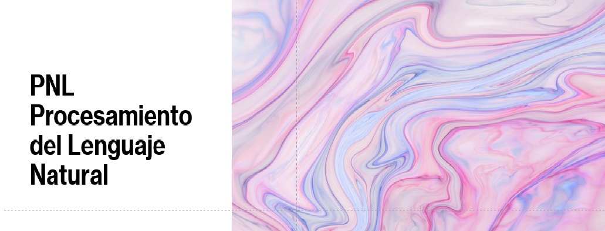

Este repositorio fue pensado para contener las experiencias de aprendizajes durante el curso de **Procesamiento del Lenguaje Natural** de la Especialización en Inteligencia Artificial de la UBA, dependiente de la Facultad de Ingeniería.

<h2> Descripción del curso </h2>

<h2> Desafios </h2>
<h3> Desafio 1 </h3>

Para este desafío, se llevó a cabo un análisis de similaridad de documentos con el conjunto de datos 20 Newsgroups:

**Vectorización y Similaridad:** 

Se utilizaron métodos TF-IDF para vectorizar los documentos y se midió la similaridad de coseno entre un documento seleccionado y los 5 más similares.
Modelos de ML: Se entrenaron modelos de Naive Bayes (Multinomial y ComplementNB) para clasificar documentos, optimizando hiperparámetros mediante búsqueda aleatoria para maximizar el f1-score macro en el conjunto de prueba.

**Similaridad de Palabras:** 

Se seleccionaron 5 palabras y se analizaron sus palabras más similares utilizando el mismo enfoque de vectorización.

**Modelo:** Se entrenaron modelos de Naive Bayes (Multinomial y ComplementNB) para clasificar documentos con ajustes de hiperparámetros.

<h3> Desafio 2 </h3>
Para este desafío, se utilizó una muestra de reseñas del conjunto de datos IMDB reviews para entrenar un modelo Word2Vec y analizar la similaridad entre palabras en el contexto:

**Tokenización y Entrenamiento de Word2Vec:** 
Se tokenizaron las reseñas y se entrenó un modelo Word2Vec con Gensim.
**Análisis de Similaridad:** 
Se analizaron palabras seleccionadas y se identificaron las más cercanas en el espacio vectorial de Word2Vec.

**Visualización de Embeddings:** Se visualizaron los embeddings en 2D.

